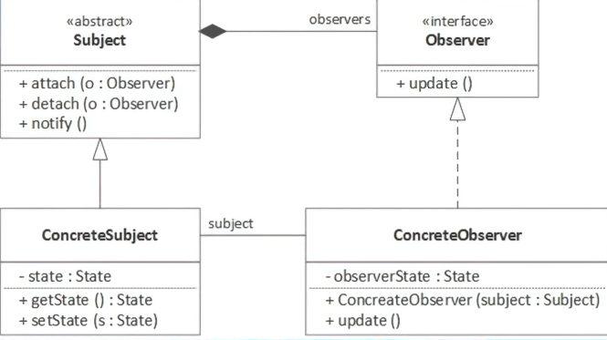

## 🧭 Observer Design Pattern

---

This Simple Implementation with java  demonstrates the Observer Design Pattern, where:

Subject (e.g., WeatherStation) maintains a list of observers and notifies them of state changes.

Observers (e.g., PhoneDisplay) subscribe to the subject and implement an update() method to react to changes.

An event (like a temperature change) triggers the subject to notify all registered observers.

This pattern promotes loose coupling and is ideal for situations where multiple components need to respond to state changes in a central source.

The following Image is an UML diagram for the observer design pattern: 

